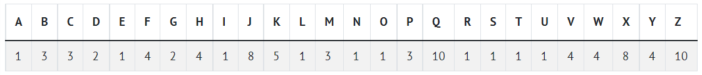

Determine which of two Scrabble words is worth more.

```
$ ./scrabble
Player 1: COMPUTER
Player 2: science
Player 1 wins!
```

## [Getting Started](https://cs50.harvard.edu/x/2022/labs/2/#getting-started)

Open [VS Code](https://code.cs50.io/).

Start by clicking inside your terminal window, then execute `cd` by itself. You should find that its “prompt” resembles the below.

Click inside of that terminal window and then execute

```
wget https://cdn.cs50.net/2021/fall/labs/2/scrabble.zip
```

followed by Enter in order to download a ZIP called `scrabble.zip` in your codespace. Take care not to overlook the space between `wget` and the following URL, or any other character for that matter!

Now execute

to create a folder called `scrabble`. You no longer need the ZIP file, so you can execute

and respond with “y” followed by Enter at the prompt to remove the ZIP file you downloaded.

Now type

followed by Enter to move yourself into (i.e., open) that directory. Your prompt should now resemble the below.

If all was successful, you should execute

and you should see a file called `scrabble.c`. Open that file by executing the below:

If you run into any trouble, follow these same steps steps again and see if you can determine where you went wrong!

## [Background](https://cs50.harvard.edu/x/2022/labs/2/#background)

In the game of [Scrabble](https://scrabble.hasbro.com/en-us/rules), players create words to score points, and the number of points is the sum of the point values of each letter in the word.



For example, if we wanted to score the word `Code`, we would note that in general Scrabble rules, the `C` is worth `3` points, the `o` is worth `1` point, the `d` is worth `2` points, and the `e` is worth `1` point. Summing these, we get that `Code` is worth `3 + 1 + 2 + 1 = 7` points.

## [Implementation Details](https://cs50.harvard.edu/x/2022/labs/2/#implementation-details)

Complete the implementation of `scrabble.c`, such that it determines the winner of a short scrabble-like game, where two players each enter their word, and the higher scoring player wins.

-   Notice that we’ve stored the point values of each letter of the alphabet in an integer array named `POINTS`.
    -   For example, `A` or `a` is worth 1 point (represented by `POINTS[0]`), `B` or `b` is worth 3 points (represented by `POINTS[1]`), etc.
-   Notice that we’ve created a prototype for a helper function called `compute_score()` that takes a string as input and returns an `int`. Whenever we would like to assign point values to a particular word, we can call this function. Note that this prototype is required for C to know that `compute_score()` exists later in the program.
-   In `main()`, the program prompts the two players for their words using the `get_string()` function. These values are stored inside variables named `word1` and `word2`.
-   In `compute_score()`, your program should compute, using the `POINTS` array, and return the score for the string argument. Characters that are not letters should be given zero points, and uppercase and lowercase letters should be given the same point values.
    -   For example, `!` is worth `0` points while `A` and `a` are both worth `1` point.
    -   Though Scrabble rules normally require that a word be in the dictionary, no need to check for that in this problem!
-   In `main()`, your program should print, depending on the players’ scores, `Player 1 wins!`, `Player 2 wins!`, or `Tie!`.

### [Walkthrough](https://cs50.harvard.edu/x/2022/labs/2/#walkthrough)

### [Hints](https://cs50.harvard.edu/x/2022/labs/2/#hints)

-   You may find the functions `isupper()` and `islower()` to be helpful to you. These functions take in a character as the argument and return a boolean.
    
-   To find the value at the `n`th index of an array called `arr`, we can write `arr[n]`. We can apply this to strings as well, as strings are arrays of characters.
    
-   Recall that computers represent characters using [ASCII](http://asciitable.com/), a standard that represents each character as a number.
    

Not sure how to solve?

### [How to Test Your Code](https://cs50.harvard.edu/x/2022/labs/2/#how-to-test-your-code)

Your program should behave per the examples below.

```
$ ./scrabble
Player 1: Question?
Player 2: Question!
Tie!
```

```
$ ./scrabble
Player 1: Oh,
Player 2: hai!
Player 2 wins!
```

```
$ ./scrabble
Player 1: COMPUTER
Player 2: science
Player 1 wins!
```

```
$ ./scrabble
Player 1: Scrabble
Player 2: wiNNeR
Player 1 wins!
```

Execute the below to evaluate the correctness of your code using `check50`. But be sure to compile and test it yourself as well!

```
check50 cs50/labs/2022/x/scrabble
```

Execute the below to evaluate the style of your code using `style50`.

## [How to Submit](https://cs50.harvard.edu/x/2022/labs/2/#how-to-submit)

In your terminal, execute the below to submit your work.

```
submit50 cs50/labs/2022/x/scrabble
```